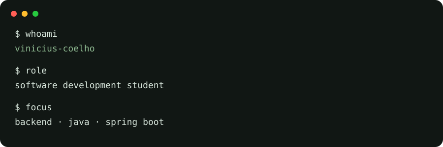
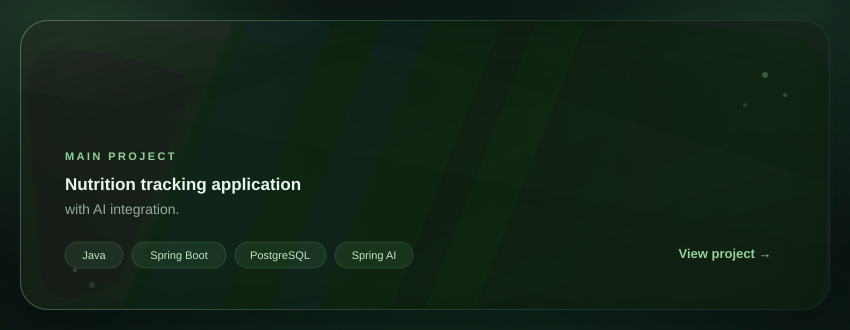

  

## Main Project

  

## Featured Projects

<table>
<tr>

<td width="50%" align="center">

<h3>Drone</h3>

Autonomous drone project focused on navigation and algorithms.

<code>Java</code>
<code>Algorithms</code>

<a href="https://github.com/vinilleri/Drone-Navigation-Api">
  View project →
</a>

</td>

<td width="50%" align="center">

<h3>Wearable</h3>

Wearable project combining software and hardware.

<code>Java</code>
<code>Spring Boot</code>
<code>PostgreSQL</code>

<a href="https://github.com/vinilleri/Wearable-API">
  View project →
</a>

</td>

</tr>
</table>

## Tech Stack

## GitHub Stats

